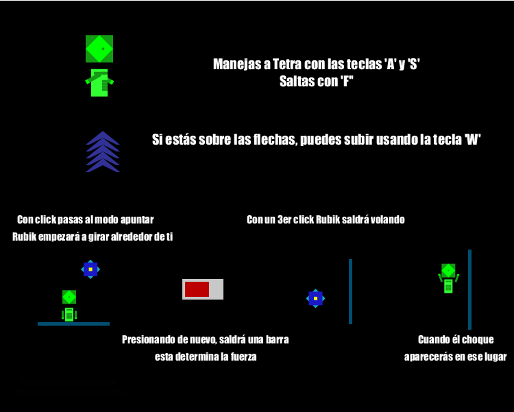
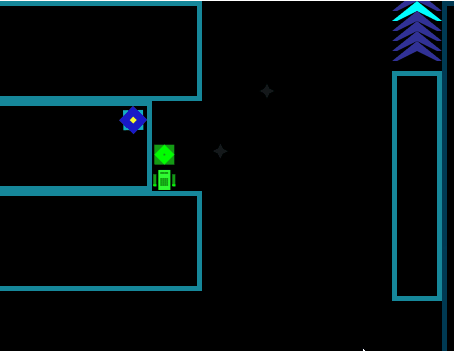
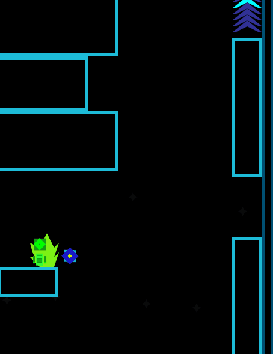

# **Título**: 	

## **Hecho por**

Daniel Barrios-2190407

Jorge Angarita-2190427

## **Descripción**: 

Después de una monótona vida en las tierras de *Euclidius*, *Tetra* decide salir de aquella *prisión* para descubrir qué más allá y al mismo tiempo demostrar su valía. En esta aventura lo acompañará *Rubik*, su pequeño amigo flotante, juntos tendrán que sortear diversos obstáculos para así superar la última frontera. 

#### Género:

Videojuego de plataformas de precisión.

#### Clasificación por edades:

Recomendado para toda la familia/ Para personas de más de 7 años

#### Requisitos:

- Librería processing.sound

- Fuente IMPACT instalada en el computador (Opcional)

##### ¿Cómo instalarla?

  Simplemente abres el archivo IMPACT de la carpeta de Juego Fase Alpha, y le das click izquierdo y seleccionas la opción instalar.

## **Galería**: 

Nuestros Protagonistas, de izquierda a derecha vemos a Rubik y a Tetra:

El colorido menú principal:

Controles del juego:

Nuestros héroes en su aventura:

Modo Pausa, para darte un descanso o para terminar por hoy, lo puedes abrir en cualquier momento del juego:

## **Características**: 

100% de los gráficos hechos en Processing:

¡Pide ayuda a Rubik para teletransportarte!

¡Ten cuidado!, no quisieras volver a empezar...

## **Banner**:

## **Gif corto**:

## **Créditos**:

- A freeSound.org por su plataforma para descargar fácilmente variedad de sonidos
- Al usuario sharesynth de la anterior plataforma, creador del audio de salto usado en el juego

Link a su trabajo: https://freesound.org/people/sharesynth/sounds/344502/

- Al usuario Sergenious de la anterior plataforma, creador del audio de teletransportación usado en el juego

Link a su trabajo: https://freesound.org/people/Sergenious/sounds/55853/

- Al usuario TheDweebMan de la anterior plataforma, creador del audio de apuntar usado en el juego

Link a su trabajo: https://freesound.org/people/TheDweebMan/sounds/277215/

- A Aaron Daniel, youtuber y creador de los remix utilizados en el menú y en el nivel del juego

Link a su trabajo: https://soundcloud.com/aaron-daniel-713950580/popular-tracks

- A Relogic, equipo desarrolador del videojuego Terraria, que fueron los creadores originales de 2 canciones del juego

Link de la página del juego: https://terraria.org/

- A Geoffrey Lee creador de la fuente IMPACT, usada en este proyecto
- Al equipo de Nexile, creadores de Jump King, principal fuente de inspiración del juego

Link de la página del juego: https://nexile.se/jump-king-online/
